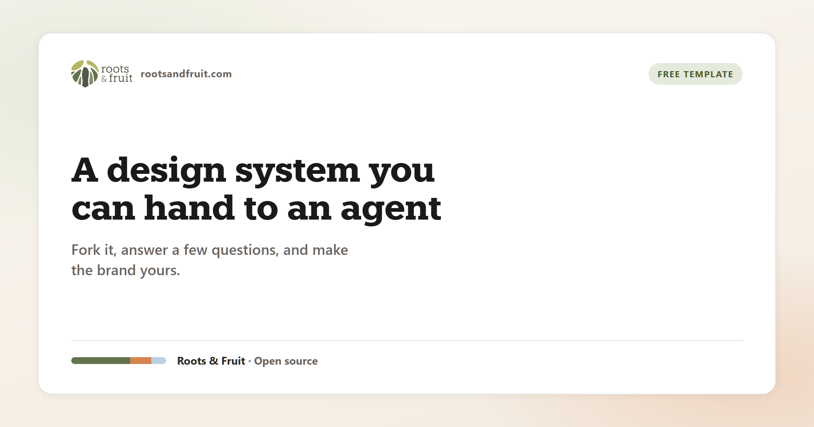

# Design System Template

[](LICENSE)
[](https://github.com/Roots-and-Fruit/design-system-template/generate)
[](https://roots-and-fruit.github.io/design-system-template/)
[](CUSTOMIZE.md)

<p align="center">
  
</p>

A free, open design system you can fork and make your own. It gives your brand clear colors, type, and components, plus a simple contract that coding agents can follow so new screens stay on-brand.

## Why use this

Most brand kits are a PDF and a folder of logos. Beautiful for humans. Almost useless for an agent building a page.

This template puts the same decisions where tools can use them: one place for colors and fonts, a small set of ready-made pieces (buttons, forms, layouts), and a short written contract called `DESIGN.md` that says what the brand should and should not look like.

You get a system that looks finished on day one, and a path to make it yours without rebuilding from scratch.

## Who it is for

Designers and founders who want a real system, not a mood board. Builders and agents who need rules they can follow. Teams who want the brand to survive the next round of AI-generated UI.

## How easy is “make it yours”?

1. Click **Use this template** on GitHub (this is a template repository).
2. Open the live site in the new repo, or run `npx serve .` locally.
3. Go to **Make it your own** and tell your agent:

```text
Walk me through this project's customization checklist
```

4. Answer a few questions: logos, name, colors, fonts.
5. Your agent updates the kit and runs one command. The reference site now shows your brand.

That is the whole mechanical path. The checklist your agent follows lives in [`CUSTOMIZE.md`](CUSTOMIZE.md).

## What you get

A browsable reference site with colors, type, layout, and components. A single stylesheet you can drop into a project. Role-named design tokens (primary, accent, paper, ink) so a rebrand does not mean renaming everything. Four layout building blocks that adapt without a breakpoint for every block. And a normative `DESIGN.md` file so agents prefer your rules over their own taste.

## Try the demo

[Live reference site](https://roots-and-fruit.github.io/design-system-template/) · [Make it your own](https://roots-and-fruit.github.io/design-system-template/customize.html)

Or open the folder locally:

```bash
npx --yes serve .
```

Serving it also enables smooth page transitions in browsers that support them.

## Use it in a project

```html
<link rel="stylesheet" href="css/cds.css">
```

Already have styles for headings and links? Import `tokens.css`, `layouts.css`, and `components.css`, and skip `base.css`.

## For agents

Point your agent at [`AGENTS.md`](AGENTS.md). Job B is the customize path: read [`CUSTOMIZE.md`](CUSTOMIZE.md), fill [`brand.json`](brand.json), run `npm run customize`, then rewrite the prose in `DESIGN.md` so it sounds like the real brand.

You do not need a build step to view the site. The customize command is only for applying a fork.

## License and credit

MIT. Free to use and change. The brand you build with it is yours.

The sidebar includes a small Roots & Fruit credit so others can find the kit. Leaving it is appreciated. If it does not fit your site, remove it, and a social shout-out is genuinely welcome instead.

Maintained by [Roots & Fruit](https://rootsandfruit.com).
